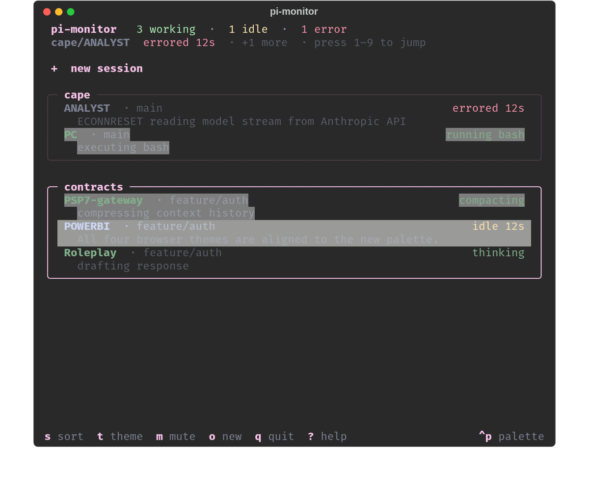

# pi-monitor

Live, tmux-aware status monitor for [pi](https://github.com/badlogic/pi-mono) coding agents.

> **0.4.x ships the TypeScript build as canonical** — install via `npm install -g @hshayde/pi-monitor` (or `pnpm add -g @hshayde/pi-monitor`). The npm package is scoped because the unscoped `pi-monitor` name was already taken; the installed binary on PATH is still just `pi-monitor`. The Python build documented below continues at 0.3.x and stays installable via `uv tool install --from git+https://github.com/hshayde/pi-monitor pi-monitor`. The TS sources live at [`ts/`](./ts) with their own [README](./ts/README.md) and [CHANGELOG](./ts/CHANGELOG.md). Both suites run on every push. See [`docs/REWRITE_PLAN.md`](./docs/REWRITE_PLAN.md) for the rewrite story.

When you run several pi sessions across multiple tmux sessions and panes, it's hard to tell at a glance which agents are streaming, which are stalled, and which are idle waiting for your next prompt. `pi-monitor` gives you a single split view: a card-per-session list of every pi pane on the left with live state + activity, and a real, fully-interactive view of the agent you cursored on the right — without ever moving the source pane out of its origin tmux session.

```
┌─────────────────────────────────────────────────┬───────────────────────┐
│ pi-monitor   2 working · 1 idle · 1 error           │                        │
│ cape/ANALYST  errored 12s  · press 1–9 to jump      │                        │
│                                                    │                        │
│ +  new session                                     │                        │
│ ╭─ contracts ──────────────────────────────────╮ │                        │
│ │  PSP7-gateway · feature/auth          running bash│ │   the actual pi agent  │
│ │    executing bash                                 │ │   you cursored, fully  │
│ │  POWERBI · feature/billing                idle 12s│ │   interactive (real    │
│ │    All four browser themes are aligned to the new│ │   tmux pane)           │
│ ╰─────────────────────────────────────────────────╯ │                        │
│ ╭─ cape ───────────────────────────────────────╮ │                        │
│ │  ANALYST · main                       errored 12s │ │                        │
│ │    ECONNRESET reading model stream                │ │                        │
│ ╰─────────────────────────────────────────────────╯ │                        │
└─────────────────────────────────────────────────┴───────────────────────┘
```

Everything in the left column renders with `background: transparent` so your terminal's translucency / wallpaper bleeds through end-to-end. Each session is a rounded card with the project name in the border title. Each pane row is two lines: `name · git-branch  …  state-tag` on top, dim live activity (`executing bash`, `compressing context history`, the trimmed last assistant response, the error message) on the bottom. The cursor-card border lights up; the cursor row gets a soft selection bg.



## Install

From source (until published to PyPI):

```bash
uv tool install --from git+https://github.com/hshayde/pi-monitor pi-monitor
```

Or for development:

```bash
git clone https://github.com/hshayde/pi-monitor
cd pi-monitor
uv tool install -e .
```

### Optional: heartbeat extension (much more accurate state)

The default JSONL/mtime classifier can't tell `compacting`, `retrying`, or
`awaiting_permission` apart from plain idle/working. The bundled
`pi-monitor-heartbeat` pi extension publishes a small status file from
inside each pi process so the monitor reads ground truth directly.
Install once (the extension is auto-discovered from
`~/.pi/agent/extensions/`):

```bash
ln -sf "$(pwd)/extensions/pi-monitor-heartbeat" ~/.pi/agent/extensions/pi-monitor-heartbeat
```

New pi processes pick it up automatically. Without the extension,
pi-monitor falls back to the JSONL heuristic — nothing breaks, you just
get the slightly less accurate v1 classification.

## Quickstart

1. Add a hotkey to `~/.tmux.conf`:

   ```tmux
   bind-key m run-shell 'pi-monitor'
   ```

2. (Optional) add a status-line widget showing aggregate counts in every session:

   ```tmux
   set -g status-right '#{@pi-monitor-status}  %H:%M'
   ```

3. Reload config and launch:

   ```bash
   tmux source ~/.tmux.conf
   ```

   Then press `prefix + m` to summon the monitor.

## How it works

- A dedicated `monitor` tmux session is created on first run with two panes side by side: the Textual TUI on the left, an idle "right slot" on the right.
- Pressing `Enter` on a pane row creates (or reuses) a `tmux new-session -t <source>` session-group sister of that pane's source session, focuses the agent's window+pane in that sister, then `respawn-pane`s the right slot with `env -u TMUX tmux attach -t <sister>`. The right slot is now a real, fully interactive nested tmux client. The source pane is **never moved** — your project session's split is left alone.
- Picking an agent in a different source session swaps the right slot to a fresh sister and kills the previous one. Picking another agent in the same source session just retargets the existing sister.
- Because the right slot is a nested tmux client, its prefix is set to **`C-a`** (the outer monitor session keeps the default `C-b`), so the two clients' keybindings don't collide. The viewer session's own status line is also disabled — the outer monitor bar already carries pi-monitor's aggregate counts, so we don't stack a duplicate inside the right pane.
- Status is inferred from each pane's pi session JSONL file (`~/.pi/agent/sessions/`) plus its mtime. No screen scraping.
- Aggregate counts (`🔴N 🟡N 🟢N`) are pushed to a tmux user option `@pi-monitor-status` every 500ms while the TUI runs, so your `status-right` shows them in every session.
- Crash-safe: every launch sweeps any leftover `pi-monitor-view-*` sister sessions before opening, and the right slot is always reset to its placeholder.

## Keybindings

| Key                     | Action                                                                                                                                                                |
| ----------------------- | --------------------------------------------------------------------------------------------------------------------------------------------------------------------- |
| `j` / `k` / `↓` / `↑`   | Move selection. Hovering a pi row previews it live in the right pane, zoomed so non-pi siblings sharing the source window are hidden. Cursor focus stays on the tree. |
| `Enter` (or click)      | Commit — hand keyboard focus to the right pane so keys go to the agent.                                                                                               |
| `Tab`                   | Same as Enter for a pane row                                                                                                                                          |
| tmux `prefix + ←`       | Native tmux nav back to the tree pane                                                                                                                                 |
| `C-a z` (in right pane) | Inner viewer: unzoom to see the source window's other panes                                                                                                           |
| `C-a "` / `C-a %`       | Inner viewer: split inside the right slot                                                                                                                             |
| `C-a` (in right pane)   | Prefix for the inner viewer client (e.g. `C-a [` to scroll)                                                                                                           |
| `h` / `l` / `←` / `→`   | Jump to the previous / next session card                                                                                                                              |
| `g` / `G`               | Jump to top / bottom                                                                                                                                                  |
| `s`                     | Cycle sort: tmux-order ↔ needs-attention-first                                                                                                                       |
| `t`                     | Cycle theme (curated set: tokyo-night, catppuccin-mocha, dracula, gruvbox, textual-dark; pinning others in config still works)                                        |
| `Shift+H`               | Toggle showing non-pi panes                                                                                                                                           |
| `r`                     | Force refresh now                                                                                                                                                     |
| `m`                     | Toggle desktop notifications (mute/unmute)                                                                                                                            |
| `q`                     | Quit: kill all `pi-monitor-view-*` sisters and the monitor session                                                                                                    |
| `1`–`9`                 | Jump to the Nth pane in display order                                                                                                                                 |

## States

The TUI itself is glyph-free — state is conveyed by **color** (the row title pulses in the success color while the agent is working; idle / error / waiting / retrying tint the right-hand state tag) and by a short **state word** in that tag. Emojis below are used only by the tmux status-line widget that pi-monitor pushes to `@pi-monitor-status` so you can show aggregate counts in your normal `status-right`.

| State    | Meaning                                                                               | Emoji (tmux status only) |
| -------- | ------------------------------------------------------------------------------------- | ------------------------ |
| working  | agent is streaming, running a tool, or compacting                                     | 🟢                       |
| idle     | agent finished, awaiting your next prompt                                             | 🔴                       |
| error    | last assistant message has a non-retryable error                                      | ❌                       |
| waiting  | agent is blocked on a user decision (heartbeat extension only)                        | 🟠                       |
| retrying | pi is auto-retrying a transient API error (heartbeat extension only; no notification) | 🔵                       |
| unknown  | pane runs pi but no JSONL detected and no heartbeat                                   | ❓                       |
| no pi    | no pi running in this pane                                                            | ⚫                       |

## Activity descriptions

The second line of each pane row is a dim, ellipsized one-liner describing **what the agent is doing right now**, picked in priority order:

1. **Heartbeat phase** (when the [`pi-monitor-heartbeat`](#optional-heartbeat-extension-much-more-accurate-state) extension is running inside that pi):
   - `tool_running` + `current_tool=bash` → `executing bash`
   - `compacting` → `compressing context history`
   - `agent_running` → `drafting response`
   - `retrying` + `retry_attempt=2` → `retrying after transient error (attempt 2)`
   - `awaiting_permission` → `waiting for your decision`
2. **JSONL last_error** (for ERROR rows): the trimmed error message from the trailing assistant turn, e.g. `ECONNRESET reading model stream from Anthropic API`.
3. **JSONL last_assistant_preview**: the first text chunk of the agent's most recent response, e.g. `All four browser themes are aligned to the new palette.`. Capped at 80 chars in the UI.
4. **Empty** when none of the above apply (NO_PI, fresh session with no flushed turns, etc.).

The right-hand state tag also surfaces heartbeat info: `working` becomes `running bash`, `compacting`, `thinking`, `retrying #2`, or `awaiting input` when the heartbeat is publishing it.

## Theming & translucency

Press `t` to cycle through the curated theme list. The choice persists in `~/.config/pi-monitor/config.json` and the state colors (working / idle / error) automatically follow the active theme's `success` / `warning` / `error` palette.

The App is constructed with Textual's `ansi_color=True`, which activates the `:ansi` pseudo-class and switches the root background to the special `ansi_default` value. That makes every transparent-resolved cell emit the ANSI default-bg escape (`ESC[49m`), which the terminal interprets as **its** default background — so any translucency you've configured (kitty `background_opacity`, alacritty `window.opacity`, GNOME Terminal transparency, …) bleeds through end-to-end. State colors keep their explicit RGB hex values so working / idle / error tints survive.

The selected row uses `ansi_bright_black` (an ANSI palette gray) instead of an alpha-tinted theme color — alpha doesn't blend cleanly against `ansi_default`, so the palette color is the predictable choice. Modal dialogs keep a `$surface 70%` frosted tint so dense help/input text stays legible over busy backdrops.

## Notifications

By default, `pi-monitor` fires a desktop notification when a pane transitions into `idle`, `waiting`, or `error` (not into `working` or `retrying`). The transport is picked at call time: `notify-send` on Linux/\*BSD with libnotify, `osascript` (Notification Center) on macOS. If neither is on PATH — e.g. a headless SSH session — notifications are silently skipped; the in-TUI toast still fires. Each pane has a 2-second debounce to suppress flapping. Errors whose message matches pi's auto-retry regex are deferred 10 s — if pi recovers in that window the notification is dropped entirely.

Press `m` in the TUI to mute / unmute. The setting persists in `~/.config/pi-monitor/config.json`.

## Requirements

- Linux or macOS. Process resolution (walking each tmux pane's tree to its `pi` descendant + reading the pi process's start time to disambiguate panes that share a cwd) is backed by [psutil](https://github.com/giampaolo/psutil), so the same code runs on both.
- tmux ≥ 3.2 with `set -g mouse on`.
- A pi install that writes session files to the default location (`~/.pi/agent/sessions/`).

## Known limitations

- pi sessions started with `--no-session` produce no JSONL and show as `?`.
- pi sessions launched with a custom `--session-dir` are not detected.
- pi running over ssh inside a pane is not detected (the pane shows `cmd=ssh`).
- The right slot shares the source session's window with all of its other panes. If your source window is split, the right slot mirrors that split — input still goes to the cursored pane (we set `select-pane` in the sister), but you'll see the neighbouring panes shrunk alongside.

## Troubleshooting

For common issues (empty list, all-`unknown` panes, missing
translucency, branch column blank, notifications not firing on macOS,
activity tag stuck on `working`), see [TROUBLESHOOTING.md](./TROUBLESHOOTING.md).

## License

MIT
